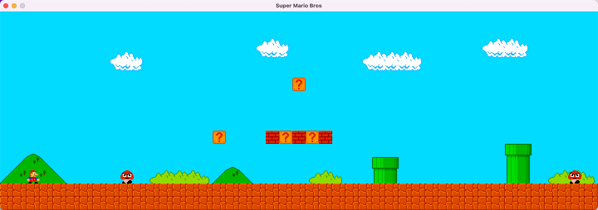

## Raw README
# Super-Mario-Bros

Remake of the original Super Mario Bros game.

Here's the video explaining how I did it: https://youtu.be/7D4uoSoQsjw

## NewREADME
### My modification
1. Screen widening
2. Added background sound effects, death sound effects, and mushroom picking sound effects.
3. Increase the compatibility of MacOS, (by default, you can only use the keyboard when you open it in the terminal, and you can run it directly in xcode after modification and use the keys)
4. Press the space bar to automatically advance, similar to parkour mode, press again to stop.
5. After death, it will be automatically resurrected after 3 seconds, and the monsters that have been eliminated will not be refreshed, which reduces the difficulty of the game. 

### Known bug
1. Under MacOS, you cannot press two arrow keys at the same time, such as pressing "Right" and "Up". By default, only "Up" will be activated.

    Solution 1.: Press the space bar to enter the parkour mode (that is, auto forward or auto backward, so that only one arrow key is needed each time), to cancel the parkour mode, you can press the arrow key again.

    Solution 2: Click mario.app, right-click "show package content", find the MacOS folder, double-click to open the shell binary inside, then go to settings, privacy settings, select input monitoring, check "terminal.app", and then click You can use the double arrow keys.

2. The game will not end after clearing, wait for the original author to update.

### Game buttons
1. Arrow keys, up, down, left, and right.
2. `Z`: Can replace the arrow keys to achieve jump.
3. `Esc` to exit the game.
4. `Enter` to reset the game.
5. `Space` parkour mode, automatic forward or backward, controlled by the arrow keys. Press again to cancel.

### Game screenshots

## 新README

### 我的修改

1. 屏幕拉宽
2. 增加背景音效，死亡音效，采蘑菇音效。
3. 增加MacOS的兼容性，（默认只能在终端打开才能用键盘，修改后可以直接在xcode运行，且使用按键）
4. 按下空格键自动前进，类似跑酷模式，再按一次可以停止。
5. 死亡后，3秒后自动复活，已经消灭的怪物不会刷新，降低游戏难度。

### 已知bug

1. MacOS下不能同时按两个方向键，比如按了"右"，"上"，默认只会激活"上"。

   解决方法1. ：按下空格键进入跑酷模式（也就是自动前进或者自动后退，这样每次只需要一个方向键就行了），取消跑酷模式可以再按一次方向键。

   解决方法2：点击mario.app，右键"显示包内容"，找到MacOS文件夹，双击打开里面的shell二进制，然后去设置，隐私设置里面，选择输入监控，勾选"终端.app"，然后就可以用双方向键了。

2. 通关后游戏不会结束，等原作者更新。

### 游戏按键

1. 方向键，上下左右。
2. `Z`: 可代替方向键上，实现跳跃。
3. `Esc`退出游戏。
4. `Enter`重置游戏。
5. `Space`跑酷模式，自动前进或者后退，由方向键控制。再按一次取消。

### 游戏截图

